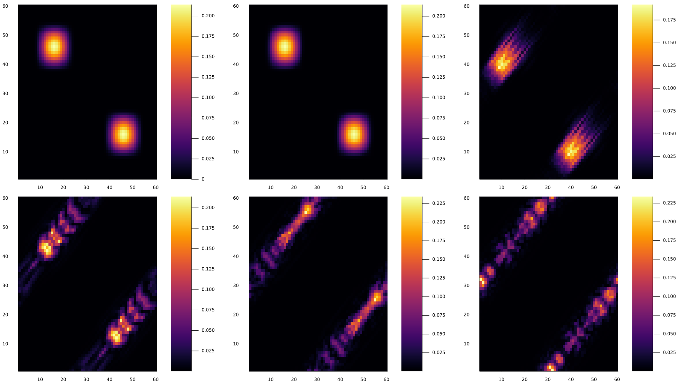

## Function
This code builds the exact N-body Schrödinger Hamiltonian, with interaction, and propagates waves in time. It can handle any number of particles but only the dimension one.

## Run
Run the script opening julia and calling
```
include("many_body_dyn.jl")
```
The example given in the script will create a potential and propagate Schrödinger's equation. At the end it will plot the potential and the one-body reduced density, and the pair density at six times.


## Example
Here is an example of the evolution of a wave, we represent the potential and the one-body density
<p align="center">
    
</p>
and the pair density at six different times
<p align="center">
    
</p>
